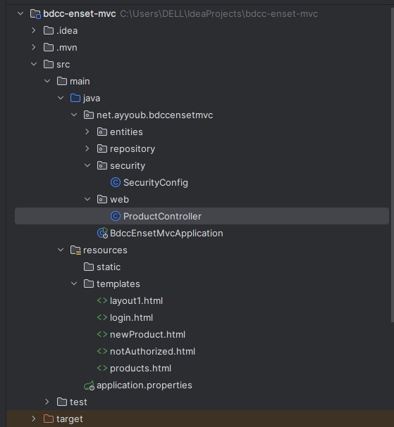
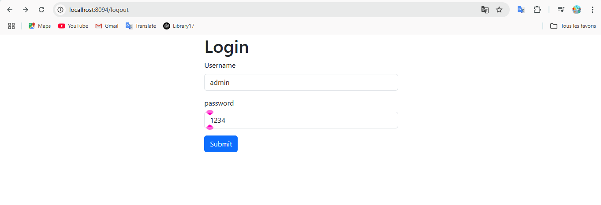
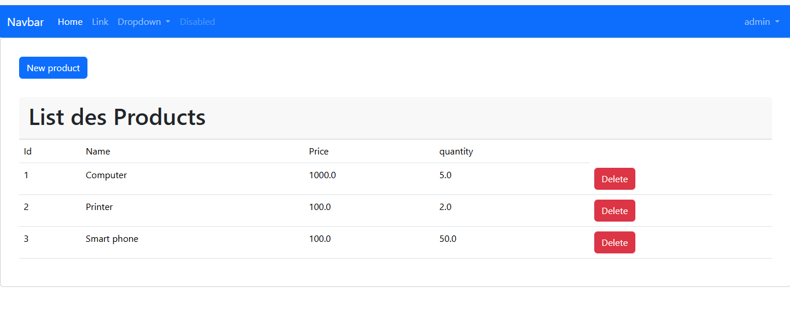
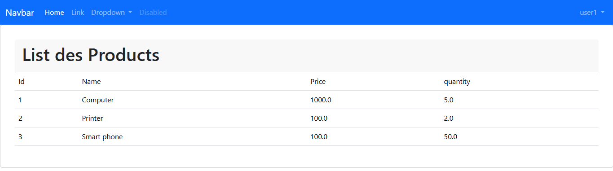
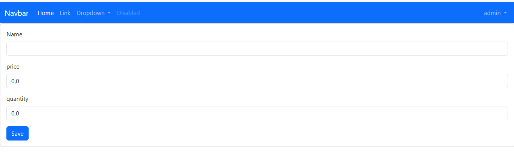
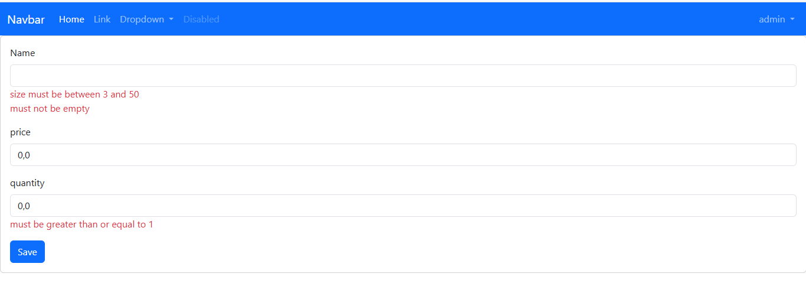

# BDCC ENSET MVC - Application de Gestion des Produits

## Auteur
**Ayyoub Ait mansour**


## Description
Application web Spring Boot MVC pour la gestion des produits avec authentification et autorisation basée sur les rôles. L'application permet aux utilisateurs de visualiser les produits et aux administrateurs de les gérer (créer, supprimer).

## Technologies Utilisées
- **Framework**: Spring Boot
- **Sécurité**: Spring Security
- **Base de données**: JPA/Hibernate (H2 en mémoire)
- **Template Engine**: Thymeleaf
- **Frontend**: HTML, CSS, Bootstrap
- **Build Tool**: Maven

## Fonctionnalités

### Authentification et Autorisation
- **Utilisateurs prédéfinis**:
    - `admin` / `1234` (Rôles: USER, ADMIN)
    - `user1` / `1234` (Rôle: USER)
    - `user2` / `1234` (Rôle: USER)

### Fonctionnalités par Rôle

#### Utilisateur (USER)
- Consultation de la liste des produits
- Accès en lecture seule

#### Administrateur (ADMIN)
- Toutes les fonctionnalités utilisateur
- Ajout de nouveaux produits
- Suppression de produits

## Structure du Projet

```
src/main/java/net/ayyoub/bdccensetmvc/
├── entities/
│   └── Product.java
├── repository/
│   └── ProductRepository.java
├── security/
│   └── SecurityConfig.java
├── web/
│   └── ProductController.java
└── BdccEnsetMvcApplication.java

src/main/resources/
├── templates/
│   ├── layout1.html
│   ├── login.html
│   ├── newProduct.html
│   ├── notAuthorized.html
│   └── products.html
└── application.properties
```

## Modèle de Données

### Entité Product
- `id`: Identifiant unique (Long)
- `name`: Nom du produit (String, 3-50 caractères, obligatoire)
- `price`: Prix du produit (Double)
- `quantity`: Quantité en stock (Double, ≥ 1)


### Accès à l'application
- **URL**: http://localhost:8094
- **Port par défaut**: 8094

### Dossier Screenshots
Pour une meilleure documentation, créez un dossier `screenshots/` à la racine du projet et ajoutez-y les captures d'écran suivantes:

```
screenshots/
├── project-structure.png      # Structure du projet dans l'IDE
├── login-page.png            # Page de connexion
├── products-list-admin.png   # Liste des produits (vue admin)
├── products-list-user.png    # Liste des produits (vue utilisateur)  
├── new-product-form.png      # Formulaire d'ajout
└── form-validation.png       # Validation des erreurs
```

## Données de Test

L'application initialise automatiquement 3 produits au démarrage:
1. **Computer** - Prix: 1000.0€, Quantité: 5
2. **Printer** - Prix: 100.0€, Quantité: 2
3. **Smart phone** - Prix: 100.0€, Quantité: 50

## Validation des Formulaires

### Validation Produit
- **Nom**: Obligatoire, entre 3 et 50 caractères
- **Prix**: Numérique
- **Quantité**: Obligatoire, minimum 1

Les erreurs de validation sont affichées en temps réel sur le formulaire.

## Captures d'Écran et Démonstration

### 1. Structure du Projet


### 2. Page de Connexion



### 3. Liste des Produits (Vue Administrateur)

### 4. Liste des Produits (Vue Utilisateur)


### 5. Formulaire d'Ajout de Produit


### 6. Validation des Formulaires


**Règles de validation:**
- Nom: 3-50 caractères, obligatoire
- Quantité: ≥ 1, obligatoire


## Contact

**Développeur**: Ayyoub  
**Projet**: BDCC ENSET MVC